# Simple Inventory Management System for Spare parts

## Description

This is a simple Inventory Management System built with Django. It includes features like login, adding, editing,
purchasing and selling inventory items.

Additionally, it includes a data analysis module to review sales history and an inventory control feature for effective
stock management.

To simplify the setup process and avoid installing MySQL directly on my computer, I used Docker.

The project is designed for small businesses to streamline inventory tracking.

## Table of Contents

- [Installation](#installation)
- [Usage](#usage)
- [Features](#features)
- [Technologies](#technologies)
- [Contributing](#contributing)
- [License](#license)

## Installation

### 1. Clone the repository:

   ```bash
   git clone https://github.com/YongbinFan/Simple-IMS-for-Spare-Parts.git
   ```

### 2. Navigate to the project directory:

   ```bash
   cd SparePartsManage
   ```

### 3. Install dependencies:

   ```bash
   pip install -r requirements.txt
   ```

### 4. Deploy Database
To set up the database, navigate to the MySQL directory and run the following commands. Ensure that Docker is installed on your system beforehand:

```bash
cd MySQL
docker-compose build
docker-compose up
```
Once the setup is complete, follow these steps to access the MySQL container:

1. Open a terminal and list the running containers to get the container ID:

```bash
docker container ls
```
2. Use the container ID (e.g., 26f307921199) to access the MySQL bash shell:
```bash
docker exec -it 26f307921199 /bin/bash
```
3. Log into MySQL with the following credentials:

    Username: root
    Password: pass

```bash
mysql -ppass -uroot
```
### 5. Run the application:
Before starting the server, you need to modify the middleware settings to disable the login check. Locate the file at:

SparePartsManage\SparePartsManage\settings.py

In the MIDDLEWARE section, comment out or remove "app01.middleware.auth.AuthMiddleware". 
The updated configuration should look like this:
```bash
MIDDLEWARE = [
    "django.middleware.security.SecurityMiddleware",
    "django.contrib.sessions.middleware.SessionMiddleware",
    "django.middleware.common.CommonMiddleware",
    "django.middleware.csrf.CsrfViewMiddleware",
    "django.contrib.auth.middleware.AuthenticationMiddleware",
    "django.contrib.messages.middleware.MessageMiddleware",
    "django.middleware.clickjacking.XFrameOptionsMiddleware",
    # "app01.middleware.auth.AuthMiddleware"
]
```
After making the changes, start the server using the command:
```bash
python manage.py runserver
```
Once the server is running, visit http://127.0.0.1:8000/user/list/ in your browser to create
a new admin user for login.

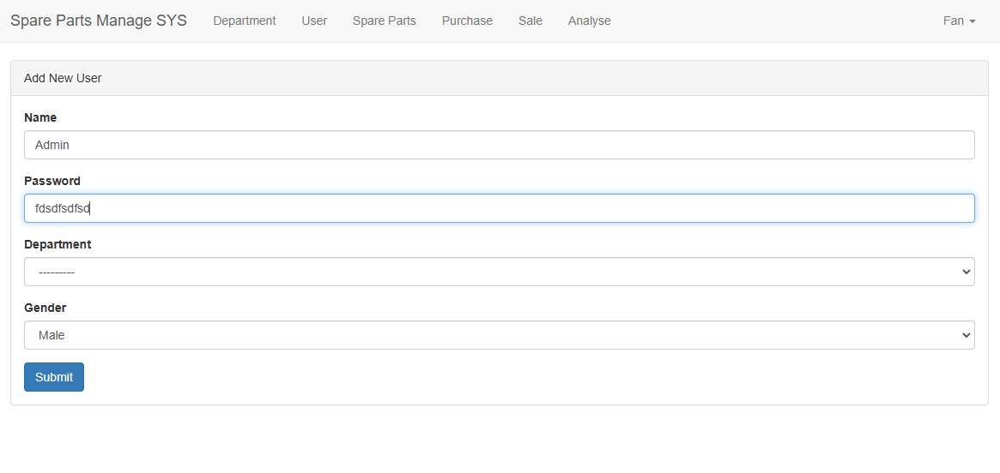

After creating the admin user, go back to the middleware settings and re-enable "app01.middleware.auth.AuthMiddleware" 
by uncommenting it.

## Usage
### 1. View the Current Inventory

Access the inventory list at: http://127.0.0.1:8000/spareparts/list/

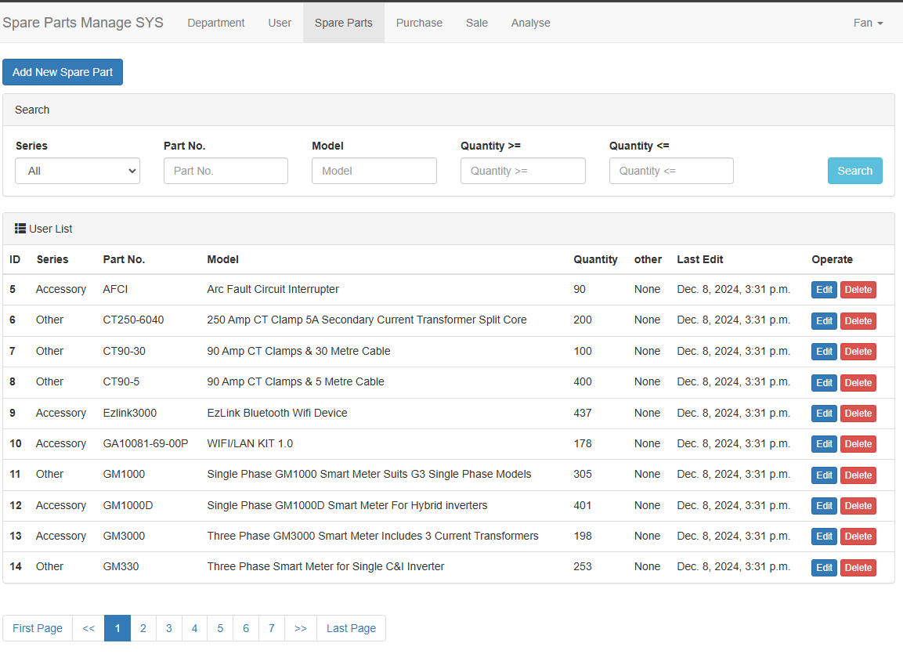
This page displays the complete inventory list with pagination functionality. You can also use the
search feature to narrow down your results. After performing a search, the pagination feature
remains fully functional.

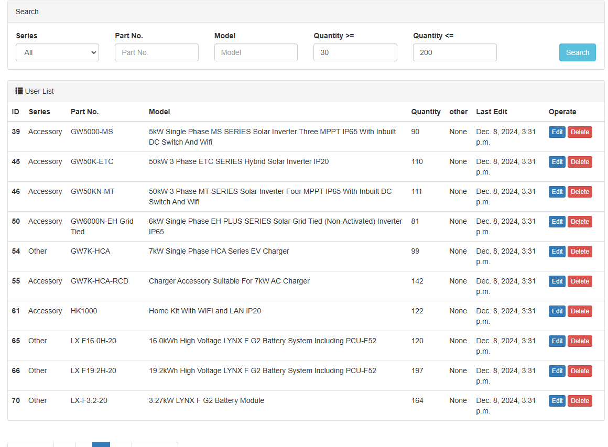
Add New Spare Part: To add a new spare part, click the Add New Spare Part button.
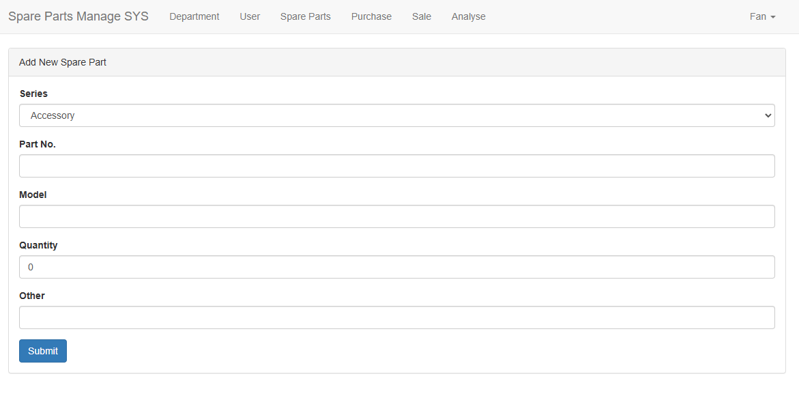
Edit an Item: To edit an existing item, click the specific Edit button. This will redirect you
to an edit page where the original data is pre-filled in the input fields.
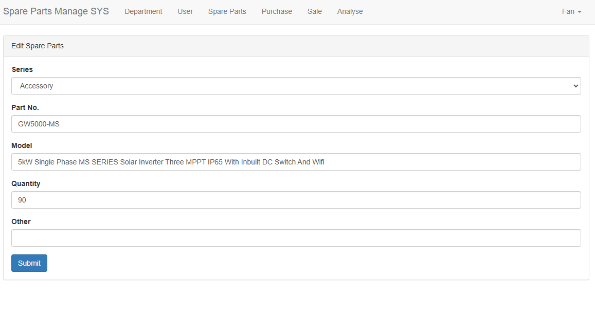
Delete an Item: To avoid accidental deletions, the delete function includes a confirmation step.
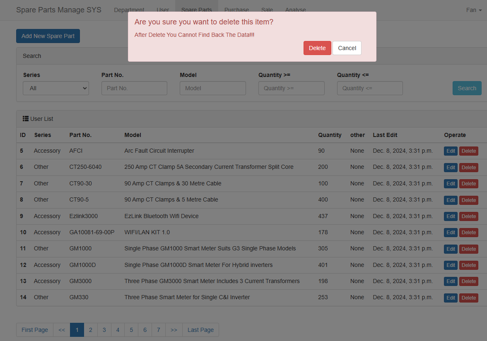

### 2. Purchase New Item
Navigate to http://127.0.0.1:8000/purchase/ to purchase new items.

On this page, as you input item information, the system will automatically narrow down the 
available options, making it easier to select the desired item.
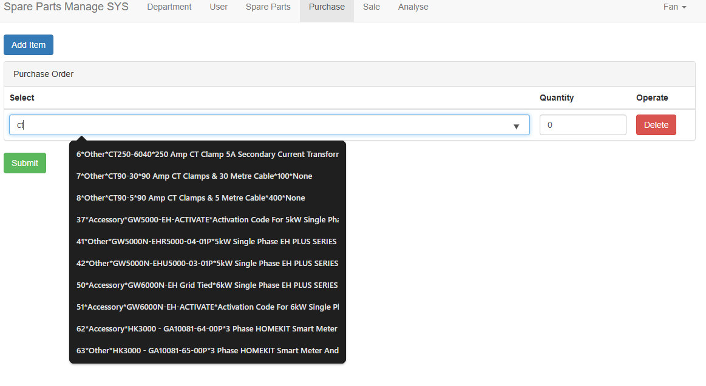
- Add Multiple Items: Use the Add Item button to include several items in the purchase list before submitting.
- Validation Checks: The system will verify the following before submission:

  - Item ID is in the correct format.
  - No duplicate items are added.
  - Quantity is greater than 0.

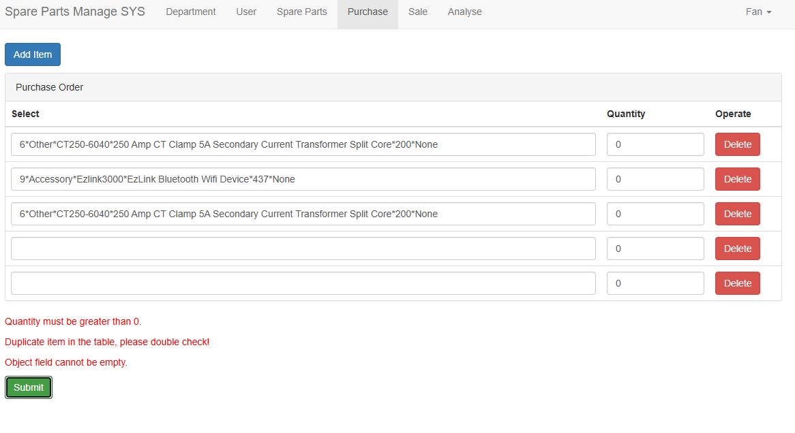

### 3. Sell Item
Access the sales page at: http://127.0.0.1:8000/sale/

This section functions similarly to the purchase module but includes an additional 
check to ensure sufficient inventory is available before completing a sale. 
This prevents overselling and helps maintain accurate stock levels.

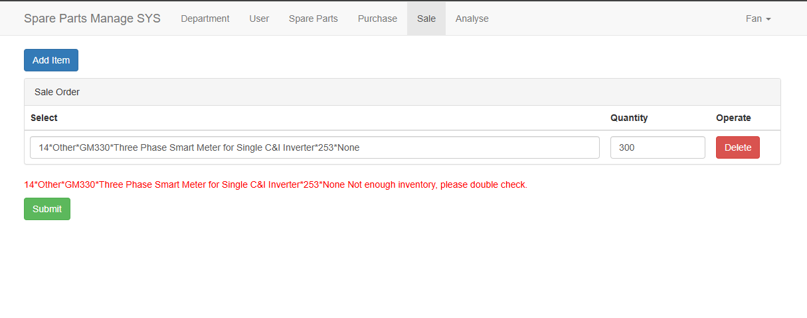

### 3. Data Analysis

This module utilizes ECharts to display dynamic, interactive charts, making it easy for users
to visualize and analyze data effectively.


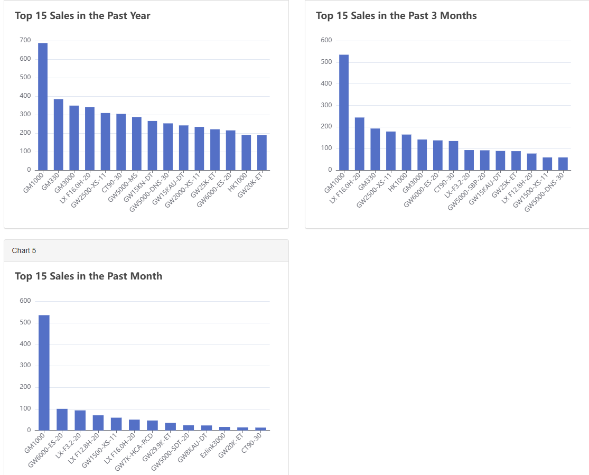
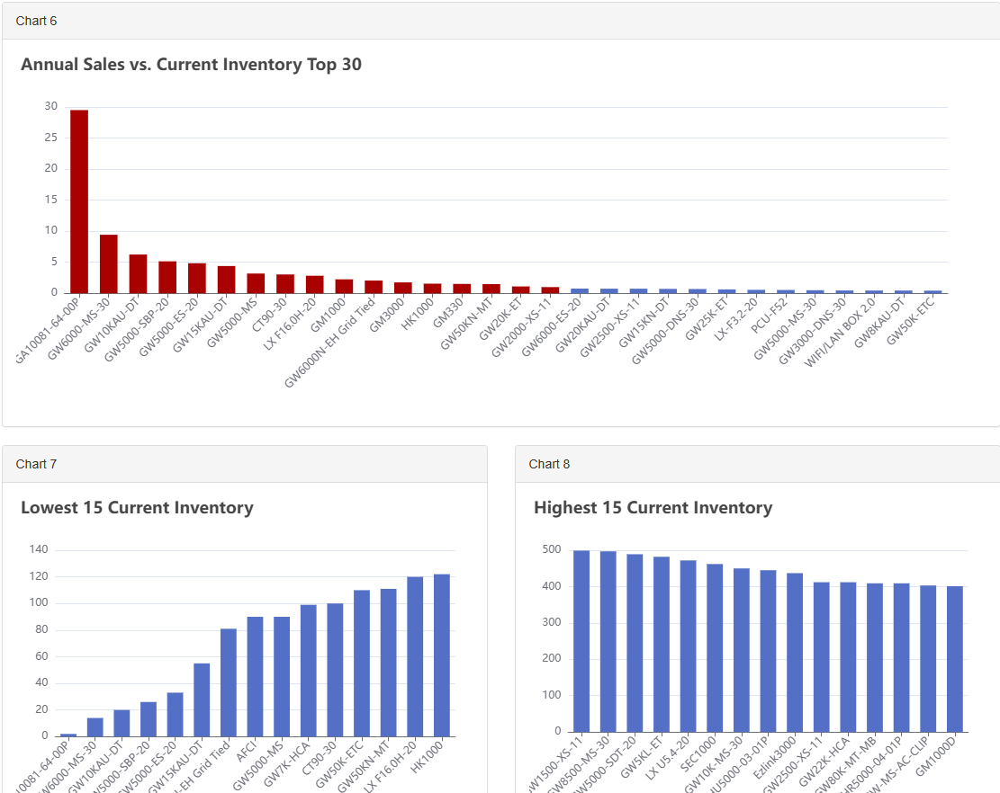
